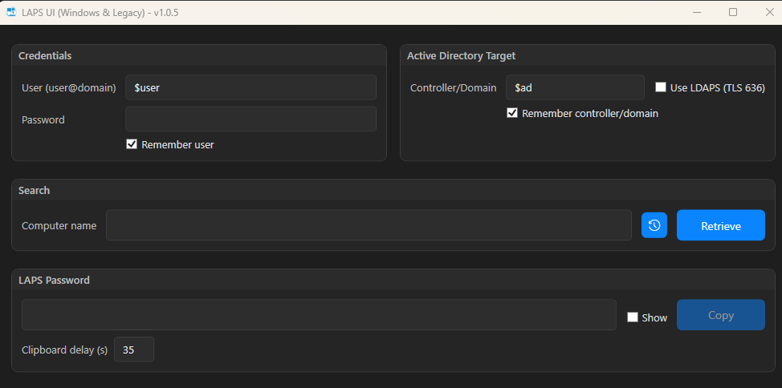

# LAPS-UI (PowerShell/WPF) - Lightweight client to retrieve LAPS passwords

> **Why?**
> On **Windows 11**, the small graphical client "LAPS UI" is no longer officially available.
> This project offers a **lightweight, local and open-source alternative** to view **Windows LAPS** (new generation) and **Legacy LAPS** passwords directly from a workstation, **without the ActiveDirectory module**.



---

## Provided

- **PowerShell script (.ps1)**: available **in the repository** (`LAPS-UI.ps1`). The Intune helpers are embedded directly in the script.
- **Windows binary (.exe)**: available **in the _Releases_ tab** of this repository.

> The `.exe` binary provided in the releases **is not signed** (no code-signing).
> - Windows SmartScreen / some EDRs may display a warning or block execution.
> - Prefer the **.ps1** (signed by you) or sign the `.exe` before deploying in production.
> - Always verify the file's **SHA256 hash** (see below).

---

## Features

- Read LAPS attributes in Active Directory via LDAP/LDAPS:
 - **Windows LAPS**: `msLAPS-Password` (+ expiration)
 - **Legacy LAPS**: `ms-Mcs-AdmPwd` (+ expiration)
- Modern **dark WPF UI** (Windows 10/11, DPI friendly) with improved graphics.
- Search by **computer name** (CN / sAMAccountName / dNSHostName).
- **LDAP** by default or **LDAPS (TLS 636)** through a checkbox.
- **Show/Hide** the password; **Copy** with **countdown** (20 s) and automatic clipboard purge.
- **"Remember user and domain"** option (saves ID and AD, encrypted in `%LOCALAPPDATA%\LAPS-UI\prefs.json`).
- **History** of retrieved computers, stored encrypted and accessible via a dedicated icon.
- Export history to a CSV file.
- **Autocomplete suggestions** for computer names with adaptive window sizing.
- **Computer name field** disabled until a **user password** is entered.
- **No password storage** on disk. No AD module required.
- Optional **Intune / Azure AD** mode: authenticate with Microsoft Graph (`DeviceManagementManagedDevices.Read.All`) to retrieve Windows LAPS credentials for managed devices, with optional custom Entra app registrations (Application/Client ID + Tenant ID).

---

## Prerequisites

- **Windows 10/11**
- **Windows PowerShell 5.1**
- **.NET Framework 4.7+**
- Network access to a **domain controller** (LDAP 389 / LDAPS 636)
- **LAPS read rights** on the targeted **Computer** objects (ACL/GPO Microsoft LAPS)
- *(Optional)* Internet access to download the **Microsoft Graph PowerShell SDK**. The script attempts to install `Microsoft.Graph.Authentication` automatically (CurrentUser scope). Offline workstations must have the SDK pre-installed (`Install-Module Microsoft.Graph`).

---

## Installation & Launch

### Option A — PowerShell script (recommended if SmartScreen/EDR is strict)
1. Get `LAPS-UI.ps1` from the repository.
2. (Optional) Unblock the file if needed:
 ```powershell
 Unblock-File .\LAPS-UI.ps1
 ```
3. Run in STA:
 ```powershell
 powershell.exe -NoProfile -ExecutionPolicy Bypass -sta -File .\LAPS-UI.ps1
 ```

### Option B — Executable (.exe) from Releases
1. Download the desired version from the Releases tab.
2. Verify the SHA256 hash (example):
 ```powershell
 Get-FileHash .\LAPS-UI.exe -Algorithm SHA256 | Select-Object Hash
 ```
3. Run LAPS-UI.exe.
If SmartScreen/EDR blocks it: use the .ps1, sign the binary, or have it approved by your policies (AppLocker/WDAC/EDR).

---

## Usage

### LAPS (AD) tab
1. **User / Password**: enter an account with LAPS read rights (or leave both blank to use your current logon token if it has the necessary ACLs).
2. **Controller/Domain**: specify your DC/domain name.
3. **LDAPS**: enable if your DC exposes 636/TLS with a valid certificate (recommended in production).
4. **Computer name**: enter the target PC (e.g. `PC-IT-1234`).
5. Click **Retrieve** → the script displays the LAPS type, expiration, and password (if authorized). The AD history and credentials are stored separately from Intune preferences.
6. Click **Copy** to place the password on the clipboard. The 20 s countdown automatically purges it (if unchanged).

### LAPS (Intune) tab
1. On first use the script downloads the Microsoft Graph PowerShell SDK (CurrentUser scope). If the workstation cannot reach the PowerShell Gallery, install it manually beforehand: `Install-Module Microsoft.Graph`.
2. *(Optional)* If you registered your own Entra application, fill the **Application (client) ID** and **Tenant ID** fields. Leave them blank to use the default **Microsoft Graph Command Line Tools** service principal. The values are stored independently from AD preferences.
3. Click **Sign in**. A browser window opens for Azure AD/Entra ID authentication (SSO, MFA, conditional access, and federated IdPs are supported). Until sign-in completes the search box, history icon, and Retrieve button remain disabled. After success, the status banner shows the connected account and the **Sign out** button becomes available.
4. Enter the Intune device name and click **Retrieve**. If multiple devices match, select one in the results list. The history icon becomes active once passwords have been retrieved during the current or previous sessions.
5. The password and expiration are retrieved from the Graph endpoint `deviceManagement/managedDevices/{id}/windowsLapsManagedDeviceInformation`. History, clipboard clearing, and the visibility toggle behave just like the AD tab, but are stored independently.

## Intune / Azure AD configuration

### Requirements
- Windows devices must be **managed by Microsoft Intune** with a Windows LAPS policy assigned.
- An Azure AD/Entra ID account with an Intune role that grants **Windows LAPS (Managed Device)** read access (e.g. Intune Administrator, or a custom role with the *Device Management > Managed Devices > Windows LAPS* permission).
- Admin consent for the **Microsoft Graph delegated permission** `DeviceManagementManagedDevices.Read.All` (prompted automatically when the first administrator runs the Intune tab).

### One-time setup
1. Allow the script to download the **Microsoft Graph PowerShell SDK** when first signing in, or pre-install it on the admin workstation:
   ```powershell
   Install-Module Microsoft.Graph
   ```
2. From the LAPS (Intune) tab, sign in with an account that can grant consent to `DeviceManagementManagedDevices.Read.All`. The Microsoft Graph PowerShell application (`Microsoft Graph Command Line Tools`) will be authorised for your tenant.
3. Verify that the Intune role assigned to helpdesk users includes the Windows LAPS permissions so they can retrieve secrets after consenting.

#### Custom app registration *(optional)*
If you prefer to control the service principal that is authorised in your tenant:

1. In Azure Portal, go to **Azure Active Directory → App registrations → New registration** and create a single-tenant app.
2. Under **API permissions**, add **Microsoft Graph → Delegated → DeviceManagementManagedDevices.Read.All**, then click **Grant admin consent**.
3. Copy the **Application (client) ID** and **Directory (tenant) ID**, then enter them in the Intune tab fields before clicking **Sign in**. Leave the fields blank to keep using the default Microsoft Graph Command Line Tools app.

### Limitations
- The Graph request uses the **beta** endpoint `deviceManagement/managedDevices/{id}/windowsLapsManagedDeviceInformation` (subject to future API changes).
- `Connect-MgGraph` is executed with `-ContextScope Process`: users must authenticate at each launch; tokens are **not persisted** to disk.
- Only Windows devices with **Intune Windows LAPS** configured will return credentials; Azure AD-only devices without Intune cannot be queried.

---

## Security

- No password is written to disk.
- The clipboard is purged after 20 s (if its content is still the copied password).
- Copy attempts to use the WinRT API (`IsAllowedInHistory=false`) to avoid the Win+V history.
- Depending on Windows/tenant settings, this exclusion may not be honored for non-packaged apps. **100% effective solutions**: disable clipboard history via GPO, or package as a signed **MSIX**.
- The "Remember user and domain" option stores the ID and AD values encrypted in `%LOCALAPPDATA%\LAPS-UI\prefs.json`.
- The Intune tab authenticates via `Connect-MgGraph -ContextScope Process`; access tokens remain in memory and are discarded when the app closes (no token cache on disk).

---

## Troubleshooting (Quick FAQ)

### Not found / no LAPS attributes
- Check spelling, OU, and your LAPS read rights.
- Try **CN**, **sAMAccountName** (`...$`) or **dNSHostName**.

### LDAPS fails
- Valid server certificate? Port **636** open? **CN/SAN** of the cert = server name?
- Test first in **signed LDAP** (LDAPS box unchecked), then switch back to **LDAPS**.

### Password appears in Win+V
- Possible if Windows ignores `IsAllowedInHistory` outside **MSIX**.
 → Disable history via **GPO** or package as a signed **MSIX**.

### SmartScreen/EDR blocks the EXE
- Prefer the **PS1**, or **sign** the EXE and have it approved via **AppLocker/WDAC/EDR**.

---

## Compatibility

- **Windows PowerShell 5.1**
- Not designed for **PowerShell 7** (WPF/WinRT differs)
